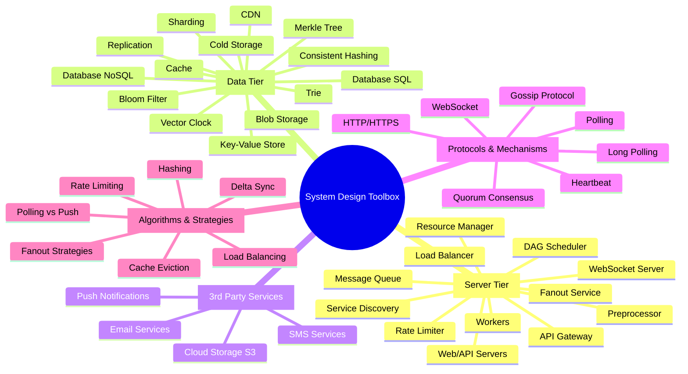

# System Design Toolbox

A comprehensive catalog of tools, components, and techniques used in system design.

---

## Table of Contents
1. [Server Tier](#server-tier)
2. [Data Tier](#data-tier)
3. [3rd Party Services](#3rd-party-services)
4. [Protocols & Mechanisms](#protocols--mechanisms)
5. [Algorithms & Strategies](#algorithms--strategies)

### Mind Map

---

## Server Tier

Components that handle business logic, traffic management, and request processing.

### Load Balancer

**What**: Distributes incoming network traffic across multiple servers to ensure no single server bears too much load.

**Why**:
- **High Availability**: Redirects traffic to healthy servers when one fails, preventing system downtime
- **Scalability**: Enables horizontal scaling by easily adding/removing servers
- **Performance**: Reduces average response time by distributing load evenly
- **Reliability**: Eliminates single point of failure (SPOF)

**How**:
- Uses algorithms (Round Robin, Least Connections, IP Hash, Weighted Round Robin) to distribute requests
- Performs health checks on backend servers
- Routes traffic only to available servers
- Can operate at different layers (L4 transport layer, L7 application layer)

**Common Algorithms**:
- **Round Robin**: Sequential distribution, simple and effective for uniform capacity
- **Weighted Round Robin**: Assigns weights based on server capacity
- **Least Connections**: Routes to server with fewest active connections
- **Least Response Time**: Optimizes for fastest response time
- **IP Hash**: Ensures session affinity by routing same client to same server
- **Consistent Hashing**: Minimizes redistribution when servers are added/removed

---

### Web/API Servers

**What**: Stateless servers that handle HTTP requests and execute business logic.

**Why**:
- **Scalability**: Stateless design allows easy horizontal scaling
- **Maintainability**: Separates concerns and simplifies deployment
- **Flexibility**: Can handle different types of requests (REST, GraphQL, etc.)
- **Reliability**: Server failures don't lose user state

**How**:
- Process incoming HTTP/HTTPS requests
- Perform authentication and authorization
- Execute business logic
- Coordinate between different services and data stores
- Return responses to clients
- Keep user session state in external storage (Redis, DB)

**Best Practices**:
- Keep servers stateless
- Use connection pooling for database connections
- Implement proper error handling and retry logic
- Add request/response logging for debugging

---

### Rate Limiter

**What**: Controls the rate of traffic sent by a client or service by limiting requests within a specified time period.

**Why**:
- **Security**: Prevents Denial of Service (DoS) attacks and resource starvation
- **Cost Reduction**: Limits excess requests, reducing server costs and protecting paid third-party API quotas
- **Fairness**: Ensures fair resource allocation among users
- **Stability**: Prevents server overload from bots or misbehaving clients

**How**:
- Can be implemented as middleware or in API gateway
- Uses algorithms like Token Bucket, Leaking Bucket, or Sliding Window
- Stores counters in fast in-memory cache (Redis) with INCR and EXPIRE commands
- Returns HTTP 429 (Too Many Requests) when limit exceeded
- Provides headers (X-Ratelimit-Remaining, X-Ratelimit-Limit, X-Ratelimit-Retry-After)

**Algorithms**:
- **Token Bucket**: Allows burst traffic, refills at fixed rate
- **Leaking Bucket**: Processes requests at fixed rate using FIFO queue
- **Fixed Window Counter**: Simple but can allow bursts at window edges
- **Sliding Window Log**: Most accurate but memory-intensive
- **Sliding Window Counter**: Hybrid approach balancing accuracy and efficiency

**Distributed Considerations**:
- Use centralized Redis for counter storage
- Handle race conditions with Lua scripts or Redis atomic operations
- Implement eventual consistency for multi-data center setups

---

### API Gateway

**What**: Fully managed service that acts as a single entry point for all client requests.

**Why**:
- **Centralized Control**: Single point for authentication, rate limiting, SSL termination
- **Security**: IP whitelisting, request validation, DDoS protection
- **Simplification**: Reduces client complexity by aggregating multiple backend services
- **Monitoring**: Centralized logging and metrics collection

**How**:
- Routes requests to appropriate microservices
- Handles cross-cutting concerns (auth, logging, rate limiting)
- Performs request/response transformation
- Supports API versioning
- Can cache responses

---

### Message Queue

**What**: Durable, in-memory buffer that supports asynchronous communication between services.

**Why**:
- **Decoupling**: Producers and consumers can scale independently
- **Reliability**: Messages persist even if consumer is temporarily unavailable
- **Scalability**: Enables horizontal scaling of both producers and consumers
- **Resilience**: Handles traffic spikes by buffering requests
- **Asynchronous Processing**: Allows long-running tasks without blocking

**How**:
- Producers publish messages to queue
- Consumers subscribe and process messages asynchronously
- Messages remain in queue until successfully processed
- Supports priorities, retries, and dead-letter queues
- Common implementations: RabbitMQ, Apache Kafka, Amazon SQS

**Use Cases**:
- Video transcoding (YouTube)
- Notification delivery
- Feed fanout
- Background job processing
- Event-driven architectures

---

### WebSocket Server

**What**: Server that maintains persistent, bi-directional connections with clients for real-time communication.

**Why**:
- **Real-time Updates**: Server can push updates to clients instantly
- **Efficiency**: Eliminates polling overhead, reduces latency
- **Bi-directional**: Both client and server can initiate communication
- **Persistent Connection**: Reduces TCP handshake overhead

**How**:
- Starts as HTTP connection, upgrades to WebSocket via handshake
- Maintains long-lived connections
- Requires efficient connection management at scale
- Used with load balancers that support WebSocket sticky sessions

**Use Cases**:
- Chat applications (1-on-1, group chat)
- Real-time notifications
- Online presence indicators
- Live collaboration tools
- Real-time gaming

---

### Service Discovery

**What**: System that automatically detects and registers available services in distributed architecture.

**Why**:
- **Dynamic Routing**: Automatically routes clients to best available server
- **High Availability**: Detects and routes around failed services
- **Load Distribution**: Balances load based on server capacity and location
- **Flexibility**: Services can be added/removed without manual configuration

**How**:
- Services register themselves with service discovery (e.g., Apache Zookeeper)
- Maintains registry of available services with metadata (location, capacity, health)
- Performs health checks and removes unavailable services
- Clients query service discovery to find best service endpoint
- Uses criteria like geographic location, server capacity, current load

**Use Cases**:
- Chat systems (finding optimal chat server)
- Microservices architectures
- Dynamic scaling environments

---

### Fanout Service

**What**: Service that distributes content/notifications to multiple recipients.

**Why**:
- **Scalability**: Efficiently handles distribution to many recipients
- **Performance**: Can pre-compute and cache for fast retrieval
- **Flexibility**: Supports different fanout models based on use case

**How**:
- **Fanout on Write** (Push): Pre-computes news feed during write time
  - Pros: Fast reads, real-time delivery
  - Cons: Expensive for users with many followers (hotkey problem), wastes resources for inactive users

- **Fanout on Read** (Pull): Generates feed on-demand during read time
  - Pros: No wasted computation for inactive users, no hotkey problem
  - Cons: Slow reads, not pre-computed

- **Hybrid Approach** (Best Practice):
  - Push model for regular users
  - Pull model for celebrities/users with many followers
  - Use consistent hashing to mitigate hotkey problems

**Use Cases**:
- News feed systems (Facebook, Twitter)
- Notification distribution
- Content delivery to followers

---

### Workers

**What**: Background servers that asynchronously process tasks from message queues.

**Why**:
- **Scalability**: Can scale worker pool independently based on queue depth
- **Reliability**: Failures can be retried automatically
- **Performance**: Offloads heavy processing from user-facing servers
- **Flexibility**: Different worker types can handle different tasks

**How**:
- Poll messages from queue
- Process tasks (transcoding, data aggregation, notification sending)
- Update results in database/cache
- Acknowledge completion to queue
- Handle errors with retry logic

**Use Cases**:
- Video transcoding (YouTube)
- Data aggregation (search autocomplete)
- Notification delivery
- Batch processing
- ETL pipelines

---

### Preprocessor (Video/Data)

**What**: Component that prepares and validates data before main processing.

**Why**:
- **Efficiency**: Splits large files into processable chunks
- **Reliability**: Validates and caches data for retry operations
- **Flexibility**: Generates processing DAG based on requirements
- **Performance**: Enables parallelization of processing tasks

**How**:
- Video splitting: Divides videos into GOP (Group of Pictures) for independent processing
- Validation: Checks data quality and format
- DAG generation: Creates task dependency graph based on configuration
- Caching: Stores preprocessed data for failure recovery

---

### DAG Scheduler

**What**: Splits Directed Acyclic Graph of tasks into stages and schedules execution.

**Why**:
- **Parallelization**: Executes independent tasks concurrently
- **Flexibility**: Supports complex workflows with dependencies
- **Efficiency**: Optimizes resource utilization

**How**:
- Analyzes task dependencies in DAG
- Identifies tasks that can run in parallel
- Puts tasks in appropriate queues (priority-based)
- Coordinates with resource manager for task assignment

---

### Resource Manager

**What**: Manages efficient allocation of computing resources to tasks.

**Why**:
- **Efficiency**: Optimally matches tasks to workers
- **Scalability**: Dynamically allocates resources based on demand
- **Reliability**: Tracks running tasks for failure recovery

**How**:
- Maintains three queues: Task, Worker, Running
- Task queue: Priority queue of pending tasks
- Worker queue: Available workers with utilization info
- Running queue: Currently executing tasks
- Task scheduler picks optimal task/worker pairs

---

## Data Tier

Components for storing, retrieving, and managing data at scale.

### Database (Relational/SQL)

**What**: Structured database using tables with predefined schemas and ACID properties.

**Why**:
- **Consistency**: ACID guarantees ensure data integrity
- **Relationships**: Efficient handling of related data with foreign keys
- **Queries**: Powerful SQL for complex queries and joins
- **Transactions**: Supports multi-step operations with rollback

**How**:
- Organizes data in tables with rows and columns
- Uses indexes for fast lookups
- Enforces constraints (primary keys, foreign keys, unique)
- Supports transactions and concurrent access control

**When to Use**:
- Data has clear structure and relationships
- Need ACID guarantees
- Complex queries and joins required
- Consistent schema across dataset

**Popular Options**: MySQL, PostgreSQL, Oracle, SQL Server

---

### Database (NoSQL)

**What**: Non-relational databases optimized for specific data models and use cases.

**Why**:
- **Scalability**: Easier horizontal scaling than relational databases
- **Flexibility**: Schema-less design adapts to changing requirements
- **Performance**: Optimized for specific access patterns (high throughput, low latency)
- **Variety**: Different types for different use cases

**Types**:
1. **Key-Value Store** (Redis, DynamoDB): Simple key-value pairs, extremely fast
2. **Document Store** (MongoDB, Couchbase): JSON-like documents with flexible schema
3. **Column-Family** (Cassandra, HBase): Optimized for write-heavy workloads
4. **Graph** (Neo4j): Optimized for relationship queries

**When to Use**:
- Need super-low latency
- Data is unstructured or semi-structured
- Need to store massive amounts of data
- Horizontal scaling is critical
- Simple access patterns (get, put by key)

---

### Database Replication (Leader-Worker)

**What**: Multiple database copies with one leader handling writes and multiple workers handling reads.

**Why**:
- **High Availability**: System continues if leader fails (promote worker to leader)
- **Read Scalability**: Distributes read load across multiple workers (80-90% of traffic is reads)
- **Data Redundancy**: Multiple copies protect against data loss
- **Reduced Latency**: Geographic distribution puts data closer to users
- **Load Distribution**: Leader focuses on writes while workers handle reads

**How**:
- Leader database accepts all write operations (INSERT, UPDATE, DELETE)
- Changes automatically replicated to worker databases
- Workers handle read operations (SELECT)
- Three replication strategies:
  1. **Asynchronous** (most common): Leader doesn't wait, better performance, slight lag
  2. **Synchronous**: Leader waits for workers, guaranteed consistency, higher latency
  3. **Semi-Synchronous**: Hybrid approach, waits for at least one worker

**Challenges**:
- **Replication Lag**: Workers may be slightly behind leader
- **Failover Complexity**: Promoting worker to leader requires careful coordination
- **Write Bottleneck**: All writes still go through single leader

---

### Database Sharding

**What**: Partitioning large databases into smaller, independent pieces (shards) distributed across multiple servers.

**Why**:
- **Horizontal Scalability**: Grows beyond single server limits
- **Increased Throughput**: Parallel processing across shards
- **Fault Isolation**: Shard failure affects only subset of users
- **Cost Efficiency**: Use commodity hardware instead of expensive vertical scaling

**How**:
- Each shard has same schema but different data subset
- Routing logic determines which shard handles each request
- Sharding key (partition key) determines data distribution

**Sharding Strategies**:
1. **Hash-based/Modulo** (`UserID % N`):
   - Pros: Simple, even distribution
   - Cons: Resharding requires data migration (use Consistent Hashing to mitigate)

2. **Range-based** (IDs 1-1000 → Shard A, 1001-2000 → Shard B):
   - Pros: Efficient for range queries
   - Cons: Can create hotspots with uneven access patterns

3. **Directory-based** (Lookup table):
   - Pros: Flexible, easy to move data between shards
   - Cons: Lookup table becomes SPOF and bottleneck

4. **Geographic** (Region-based):
   - Pros: Low latency, data locality compliance
   - Cons: Uneven load if regions have different sizes

**Challenges**:
- **Resharding**: Adding/removing shards requires complex data migration
- **Celebrity/Hotspot Problem**: Popular keys overwhelm specific shards
- **Cross-Shard Joins**: Extremely expensive, require denormalization or application-layer joins

---

### Cache (In-Memory)

**What**: Temporary in-memory storage for expensive or frequently accessed data.

**Why**:
- **Performance**: Memory access is 100x faster than disk
- **Scalability**: Reduces database load by serving repeated requests from cache
- **Cost Efficiency**: Fewer database queries = less infrastructure needed
- **User Experience**: Faster response times

**How**:
- Stores key-value pairs in memory (RAM)
- Application checks cache first, then database on miss
- Common pattern: Cache-aside (lazy loading)
- Uses eviction policies when full (LRU, LFU, FIFO)

**Cache Strategies**:
1. **Cache-Aside** (Lazy Loading):
   - App checks cache first
   - On miss: load from DB, write to cache
   - On hit: return from cache

2. **Write-Through**:
   - Write to cache and DB simultaneously
   - Ensures consistency but higher write latency

3. **Write-Behind** (Write-Back):
   - Write to cache immediately
   - Asynchronously write to DB
   - Better performance but risk of data loss

**Challenges**:
- **Cache Invalidation**: Keeping cache and DB synchronized (hardest problem in CS)
- **Thundering Herd**: Many requests for expired key overwhelm DB
- **Cache Penetration**: Queries for non-existent data bypass cache (use Bloom filter)
- **Cache Avalanche**: Mass expiration causes DB overload (add random jitter to TTLs)
- **Hot Key Problem**: Popular key overwhelms single cache node (replicate hot keys)

**Best Practices**:
- Cache data that's read frequently but modified infrequently
- Set appropriate expiration policies (not too short, not too long)
- Use multiple cache servers (no SPOF)
- Overprovision memory for growth buffer
- Monitor cache hit rate

**Popular Options**: Redis, Memcached

---

### CDN (Content Delivery Network)

**What**: Geographically distributed network of servers that cache and deliver static content.

**Why**:
- **Performance**: Serves content from server closest to user (reduced latency)
- **Scalability**: Offloads traffic from origin servers
- **Availability**: Content remains available even if origin is down
- **Bandwidth**: Reduces bandwidth costs on origin servers
- **Global Reach**: Fast content delivery worldwide

**How**:
- Caches static content (images, videos, CSS, JavaScript, HTML)
- User requests routed to nearest edge server
- Cache miss: fetch from origin, cache, then serve
- Cache hit: serve directly from edge server
- Uses cache headers (TTL) to manage freshness

**Content Types**:
- Static files: Images, videos, CSS, JS
- Dynamic content: Can cache with short TTL
- Streaming: Adaptive bitrate streaming protocols

**Cost Optimization**:
- Only serve popular content from CDN
- Use different CDN tiers for different content popularity
- Cache content closer to users who access it most

**Challenges**:
- Cache invalidation across distributed servers
- Cost for high-bandwidth content (especially video)
- Configuration complexity for dynamic content

**Popular Providers**: Cloudflare, Akamai, Amazon CloudFront, Fastly

---

### Consistent Hashing

**What**: Special hashing technique that minimizes key redistribution when servers are added or removed.

**Why**:
- **Minimal Redistribution**: Only k/n keys remapped (vs. nearly all in traditional hashing)
- **Horizontal Scaling**: Easy to add/remove cache/database servers
- **Even Distribution**: Virtual nodes provide uniform data distribution
- **Hotspot Mitigation**: Distributes load more evenly across servers

**How**:
- Maps servers and keys to points on a hash ring (0 to 2^160-1)
- Key goes to first server found clockwise on ring
- Adding server: only keys between new and previous server moves
- Removing server: only keys on removed server redistributed
- **Virtual nodes**: Each physical server mapped to multiple points on ring for better distribution

**Problems Solved**:
- **Rehashing Problem**: Traditional hash (key % N) redistributes most keys when N changes
- **Cache Misses**: Consistent hashing reduces cache miss storms during scaling
- **Uneven Distribution**: Virtual nodes balance load across non-uniform server capacities

**Use Cases**:
- Distributed caching (Memcached)
- Amazon DynamoDB partitioning
- Apache Cassandra data distribution
- Discord chat application
- CDN server selection
- Load balancing (Maglev)

---

### Key-Value Store (Distributed)

**What**: Distributed database storing data as key-value pairs with tunable consistency.

**Why**:
- **Scalability**: Horizontal scaling to store massive datasets
- **Performance**: Low-latency access optimized for simple get/put operations
- **Availability**: Continues operating during server failures
- **Flexibility**: Tunable consistency based on use case (CAP theorem tradeoffs)

**How**:
- Data partitioned across servers using consistent hashing
- Data replicated across N nodes for redundancy
- Uses quorum consensus for consistency control
- **Quorum Parameters** (N = replicas, W = write quorum, R = read quorum):
  - **Strong Consistency**: W + R > N (e.g., R=2, W=2, N=3)
  - **Fast Write**: W=1, R=N
  - **Fast Read**: W=N, R=1
  - **Weak Consistency**: W + R ≤ N

**CAP Theorem Tradeoffs**:
- **CP** (Consistency + Partition Tolerance): Blocks writes during partition, less available
- **AP** (Availability + Partition Tolerance): Accepts writes during partition, may return stale data
- Must tolerate partition (P), so choose between C or A

**Advanced Features**:
- **Versioning + Vector Clocks**: Track causality and detect conflicts
- **Gossip Protocol**: Failure detection via heartbeat propagation
- **Sloppy Quorum + Hinted Handoff**: Temporary failure handling
- **Merkle Trees**: Efficient replica synchronization and inconsistency detection

**Use Cases**:
- Shopping cart (Amazon Dynamo)
- Session storage
- User profiles
- Real-time analytics

---

### Blob Storage

**What**: Object storage system for unstructured binary data (Binary Large Objects).

**Why**:
- **Scalability**: Stores petabytes of data
- **Cost-Effective**: Cheaper than database for large files
- **Durability**: High durability through replication (99.999999999%)
- **Accessibility**: HTTP-based access from anywhere

**How**:
- Stores objects (files) with unique identifiers
- Flat namespace (no directory structure) but can simulate folders
- Metadata stored separately in database
- Supports multipart upload for large files

**Use Cases**:
- Original video storage (YouTube)
- Transcoded video storage
- User uploaded files (Google Drive)
- Backups and archives
- Static website assets

**Popular Options**: Amazon S3, Google Cloud Storage, Azure Blob Storage

---

### Cold Storage

**What**: Low-cost storage tier for infrequently accessed data.

**Why**:
- **Cost Savings**: 10-50x cheaper than hot storage
- **Long-term Retention**: Perfect for compliance/archival needs
- **Automatic Tiering**: Can transition data automatically based on access patterns

**How**:
- Higher retrieval latency (minutes to hours)
- Lower storage cost
- Retrieval fees apply
- Lifecycle policies automate data movement

**When to Use**:
- Data not accessed for months/years
- Regulatory/compliance archives
- Backups
- Old versions of files (version history)

**Popular Options**: Amazon S3 Glacier, Google Cloud Archive Storage, Azure Archive Storage

---

### Trie (Prefix Tree)

**What**: Tree data structure for efficient prefix-based string search.

**Why**:
- **Fast Prefix Search**: O(p) where p = prefix length
- **Space Efficient**: Shares common prefixes
- **Autocomplete**: Ideal for search suggestions
- **Performance**: With caching, achieves O(1) lookup for top-k queries

**How**:
- Each node represents a character
- Path from root to node forms a string
- Store frequency/popularity at terminal nodes
- Cache top-k results at each node for instant lookup

**Optimizations**:
1. **Cache Top-K at Each Node**: Trade space for time, O(1) retrieval
2. **Limit Prefix Length**: Cap at max length (e.g., 50 chars)
3. **Data Sampling**: Log only subset of queries (1 out of N)
4. **Compression**: Optimize trie structure

**Storage**:
- In-memory for fast access
- Serialize to disk (document store: MongoDB)
- Or map to key-value store (each prefix = key, children = value)

**Update Strategies**:
- Weekly/periodic rebuild (most use cases)
- Real-time updates (for trending queries, use different system)

**Use Cases**:
- Search autocomplete (Google, Amazon)
- Spell checker
- IP routing tables
- Auto-correction

---

### Bloom Filter

**What**: Space-efficient probabilistic data structure to test set membership.

**Why**:
- **Memory Efficient**: Uses bits instead of storing actual data
- **Fast**: O(k) lookup where k = number of hash functions
- **Scalability**: Handles billions of items with minimal memory

**How**:
- Bit array + multiple hash functions
- **Insert**: Hash item k times, set bits to 1
- **Lookup**: Hash item k times, check if all bits are 1
- False positives possible (says "yes" when should be "no")
- False negatives impossible (never says "no" when should be "yes")

**Use Cases**:
- URL deduplication (web crawler)
- Cache penetration prevention
- Database query optimization
- Spam filtering
- Distributed systems (check if data exists before expensive lookup)

---

### Vector Clock / Versioning

**What**: Mechanism to capture causality and detect conflicts in distributed systems.

**Why**:
- **Conflict Detection**: Identifies when concurrent writes create conflicts
- **Version History**: Tracks all modifications to data
- **Eventual Consistency**: Allows system to accept concurrent updates

**How**:
- Each data item has vector: D([S1, v1], [S2, v2], ..., [Sn, vn])
- Si = server, vi = version counter
- On write to server Si:
  - If [Si, vi] exists: increment vi
  - Otherwise: create [Si, 1]
- **No conflict**: Version X is ancestor of Y if all X counters ≤ Y counters
- **Conflict**: Versions are siblings if some counters are less and some are greater

**Conflict Resolution**:
- Client-side: Application logic reconciles conflicts
- Last-write-wins: Simple but may lose data
- Merge: Application-specific merge logic

**Use Cases**:
- DynamoDB versioning
- Distributed databases (Cassandra, Riak)
- Multi-leader replication

---

### Merkle Tree (Hash Tree)

**What**: Tree where each node is labeled with hash of its children's labels/values.

**Why**:
- **Efficient Synchronization**: Quickly detect and synchronize differences
- **Minimal Data Transfer**: Only transfer differing buckets
- **Integrity Verification**: Detect corruption or tampering

**How**:
- Leaf nodes: Hash of data blocks
- Non-leaf nodes: Hash of concatenated children hashes
- **Compare trees**: Start at root
  - Same root hash = identical data
  - Different root = traverse tree to find differing buckets
  - Only sync differing buckets

**Example**:
- 1 billion keys → 1 million buckets of ~1000 keys each
- Tree height = log(buckets)
- Very few comparisons needed to find differences

**Use Cases**:
- Anti-entropy in distributed systems (Cassandra, DynamoDB)
- Git version control
- Bitcoin/blockchain
- Peer-to-peer file sharing (BitTorrent)
- Data replication verification

---

## 3rd Party Services

External services integrated into system architecture.

### Push Notification Services

**What**: Platform-specific services for sending push notifications to mobile devices.

**Why**:
- **Engagement**: Re-engage users who aren't actively using app
- **Real-time Updates**: Notify users of important events instantly
- **Platform Integration**: Native notification support on iOS/Android

**How**:
- **iOS: Apple Push Notification Service (APNS)**
  - Requires device token + authentication
  - Binary protocol or HTTP/2

- **Android: Firebase Cloud Messaging (FCM)**
  - Requires device ID + server key
  - HTTP or XMPP protocol

- App registers device with notification service to get token
- Backend sends notification with token to push service
- Push service delivers to device

**Reliability**:
- Queue failed notifications for retry
- Monitor delivery rates
- Fallback to alternative service if primary fails

---

### SMS Services

**What**: Third-party APIs for sending SMS text messages.

**Why**:
- **Universal**: Works on all phones, no app required
- **Reliable**: High delivery rates
- **2FA**: Ideal for authentication codes
- **Fallback**: When push notifications unavailable

**How**:
- REST API with phone number and message
- Pay per message sent
- Support for global numbers with country codes

**Popular Providers**: Twilio, AWS SNS, Vonage

**Considerations**:
- Cost: Expensive for high volume
- Rate limiting: To prevent spam
- Regional support: Coverage varies by provider

---

### Email Services

**What**: SMTP-based services for sending transactional and marketing emails.

**Why**:
- **Reach**: Universal communication channel
- **Rich Content**: HTML formatting, images, attachments
- **Deliverability**: Providers optimize for inbox delivery
- **Analytics**: Open rates, click rates, bounce tracking

**How**:
- SMTP or REST API
- Template-based emails with variables
- Track delivery status, opens, clicks

**Popular Providers**: SendGrid, Mailgun, Amazon SES, Mailchimp

**Best Practices**:
- Use templates for consistency
- Implement unsubscribe mechanism
- Monitor bounce rates
- Maintain sender reputation

---

### Cloud Storage (S3)

**What**: Object storage service for storing and retrieving any amount of data.

**Why**:
- **Durability**: 99.999999999% durability (11 nines)
- **Scalability**: Unlimited storage
- **Availability**: Highly available across regions
- **Integration**: Works with CDN, lambda functions, etc.

**How**:
- REST API for upload/download
- Organize data in buckets
- Support for multipart upload (large files)
- Lifecycle policies for automatic tier transitions
- Cross-region replication for disaster recovery

**Storage Classes**:
- **S3 Standard**: Frequent access
- **S3 Infrequent Access**: Lower cost, less frequent access
- **S3 Glacier**: Archive, minutes-hours retrieval
- **S3 Glacier Deep Archive**: Lowest cost, 12-hour retrieval

**Use Cases**:
- Video storage (YouTube)
- File storage (Google Drive)
- Backup and disaster recovery
- Data lakes
- Static website hosting

---

## Protocols & Mechanisms

Communication protocols and system coordination mechanisms.

### HTTP/HTTPS

**What**: Application-layer protocol for client-server communication.

**Why**:
- **Ubiquitous**: Supported everywhere
- **Stateless**: Simplifies server design and scaling
- **Flexible**: Supports various content types
- **Secure**: HTTPS provides encryption (SSL/TLS)

**How**:
- Request-response model
- Methods: GET, POST, PUT, DELETE, etc.
- Status codes: 200 (OK), 404 (Not Found), 429 (Too Many Requests), 500 (Server Error)
- Headers for metadata (cookies, cache control, content type)

**REST Principles**:
- Stateless communication
- Resource-based URLs
- Standard HTTP methods
- JSON or XML payloads

**Keep-Alive**:
- Maintains persistent connection
- Reduces TCP handshake overhead
- Improves performance for multiple requests

---

### WebSocket

**What**: Protocol providing full-duplex communication over persistent TCP connection.

**Why**:
- **Real-time**: Server can push updates instantly
- **Bi-directional**: Both client and server can initiate communication
- **Efficient**: Eliminates polling overhead
- **Low Latency**: Persistent connection avoids handshake delays

**How**:
- Starts as HTTP connection
- Upgrades via WebSocket handshake
- Maintains persistent connection
- Both sides can send messages anytime

**Use Cases**:
- Chat applications
- Real-time gaming
- Live sports scores
- Stock tickers
- Collaborative editing
- IoT device communication

**Challenges**:
- Connection management at scale (1M+ connections per server)
- Load balancer must support WebSocket (sticky sessions)
- Firewall/proxy compatibility

---

### Long Polling

**What**: Client makes HTTP request and server holds it open until data is available.

**Why**:
- **Real-time**: Near real-time updates without WebSocket complexity
- **Compatibility**: Works through firewalls/proxies
- **Simpler**: Easier than WebSocket for some use cases

**How**:
- Client sends request
- Server holds connection open (doesn't respond immediately)
- When data available (or timeout): server responds
- Client immediately sends new request

**Challenges**:
- Sender/receiver may connect to different servers (need message queue)
- Hard to detect true disconnection vs. waiting
- Less efficient than WebSocket (still has HTTP overhead)

**Use Cases**:
- Notification systems (Dropbox, Google Drive)
- Chat systems (fallback when WebSocket unavailable)
- Real-time dashboards

---

### Polling

**What**: Client repeatedly requests server at fixed intervals to check for updates.

**Why**:
- **Simplicity**: Easiest to implement
- **Compatibility**: Works everywhere

**How**:
- Client sends request every N seconds
- Server immediately responds with current state
- Client processes response and waits before next request

**Drawbacks**:
- **Inefficient**: Most requests return "no new data"
- **Latency**: Updates delayed by polling interval
- **Resource Waste**: Server processes many unnecessary requests

**When to Use**:
- Low update frequency
- Non-critical updates
- Simplicity more important than efficiency

---

### Heartbeat Mechanism

**What**: Periodic signal sent between systems to detect failures.

**Why**:
- **Failure Detection**: Identifies offline/crashed servers
- **Connection Validation**: Ensures persistent connections are healthy
- **Monitoring**: Tracks system health

**How**:
- Client/server sends heartbeat signal at regular intervals (e.g., every 30 seconds)
- If no heartbeat received within timeout period: assume failure
- Take corrective action (reconnect, failover, remove from pool)

**Use Cases**:
- Chat systems (detect disconnected users with grace period)
- Load balancers (health checks on backend servers)
- Distributed systems (detect node failures)
- Database replication (monitor replica lag)

**Best Practices**:
- Don't mark as failed too quickly (allow for network hiccups)
- Add grace period before showing user as "offline"
- Use exponential backoff for reconnection attempts

---

### Gossip Protocol

**What**: Peer-to-peer communication protocol where nodes periodically exchange state information.

**Why**:
- **Decentralized**: No single point of failure
- **Scalable**: Works well with thousands of nodes
- **Failure Detection**: Distributed failure detection
- **Eventually Consistent**: All nodes converge to same state

**How**:
- Each node maintains membership list with heartbeat counters
- Periodically increment own heartbeat counter
- Periodically send heartbeats to random subset of nodes
- Nodes propagate heartbeats to other random nodes
- If heartbeat not increased for predefined period: mark as offline

**Properties**:
- Information spreads exponentially (like rumors)
- Eventually reaches all nodes
- Tolerates message loss and node failures

**Use Cases**:
- Cassandra (failure detection)
- DynamoDB (cluster membership)
- Consul (service discovery)
- Redis Cluster

---

### Quorum Consensus

**What**: Agreement mechanism where majority of nodes must agree before proceeding.

**Why**:
- **Consistency**: Guarantees overlapping read/write sets
- **Fault Tolerance**: System works despite node failures
- **Tunability**: Adjust consistency vs. availability tradeoff

**How**:
- **N**: Total number of replicas
- **W**: Write quorum (number of nodes that must acknowledge write)
- **R**: Read quorum (number of nodes that must respond to read)

**Configurations**:
- **Strong Consistency**: W + R > N
  - Guaranteed overlap between read and write sets
  - At least one node in read set has latest value
  - Example: N=3, W=2, R=2

- **Fast Write**: W=1, R=N
  - Write completes fast
  - Read must check all nodes

- **Fast Read**: W=N, R=1
  - Read completes fast
  - Write must wait for all nodes

- **Weak Consistency**: W + R ≤ N
  - Better performance
  - May read stale data

**Challenges**:
- **Sloppy Quorum**: Use first W healthy nodes (not strict majority)
- **Hinted Handoff**: Temporarily store data on different node if primary unavailable

---

## Algorithms & Strategies

Key algorithms and patterns used in system design.

### Rate Limiting Algorithms

See [Rate Limiter](#rate-limiter) section for details on:
- Token Bucket
- Leaking Bucket
- Fixed Window Counter
- Sliding Window Log
- Sliding Window Counter

---

### Load Balancing Algorithms

See [Load Balancer](#load-balancer) section for details on:
- Round Robin
- Weighted Round Robin
- Least Connections
- Least Response Time
- IP Hash
- Consistent Hashing

---

### Cache Eviction Policies

**What**: Algorithms to decide which items to remove when cache is full.

**Why**: Limited memory requires intelligent eviction to maximize cache hit rate.

**Algorithms**:

1. **LRU (Least Recently Used)**:
   - Evicts items not accessed for longest time
   - Best for general-purpose caching
   - Implemented with hashmap + doubly linked list
   - O(1) access and eviction

2. **LFU (Least Frequently Used)**:
   - Evicts items accessed least frequently
   - Better for non-uniform access patterns
   - More complex to implement

3. **FIFO (First In First Out)**:
   - Evicts oldest items first
   - Simplest to implement
   - Less effective for hot data

4. **Random Replacement**:
   - Randomly selects item to evict
   - Simple, but unpredictable

5. **TTL (Time To Live)**:
   - Items expire after fixed time
   - Good for time-sensitive data

**Choosing Policy**:
- General purpose: LRU
- Hotspot data: LFU
- Time-sensitive: TTL
- Simplicity: FIFO or Random

---

### Hashing Algorithms

**What**: Functions that map input data to fixed-size output.

**Use Cases**:

1. **Data Deduplication**:
   - Hash file content to detect duplicates
   - Same hash = identical content
   - Algorithms: MD5, SHA-1, SHA-256

2. **Distributed System Partitioning**:
   - Hash key to determine server/shard
   - Algorithms: MurmurHash, CityHash (fast, uniform distribution)

3. **Consistent Hashing**:
   - Minimizes redistribution during scaling
   - See [Consistent Hashing](#consistent-hashing) section

---

### Delta Sync

**What**: Synchronization technique that only transfers changed portions of data.

**Why**:
- **Bandwidth**: Dramatically reduces data transfer for updated files
- **Performance**: Faster sync for large files with small changes
- **User Experience**: Quick file updates across devices

**How**:
- Break file into blocks (e.g., 4MB chunks)
- Compute hash for each block
- Compare hashes with previous version
- Transfer only blocks with changed hashes
- Reconstruct file using new and old blocks

**Use Cases**:
- Google Drive / Dropbox file sync
- Git version control
- Rsync file transfer
- Software updates

**Combined with Compression**:
- Compress changed blocks before transfer
- Further reduces bandwidth usage

---

### Polling vs. Push Strategies

**Polling** (Pull):
- Client repeatedly requests updates
- Simple but inefficient
- Adds latency equal to polling interval

**Push**:
- Server sends updates to client
- Real-time, efficient
- Requires persistent connection (WebSocket, long polling)

**Hybrid**:
- Push for active users
- Poll for inactive users
- Best of both worlds

---

### Fanout Strategies

See [Fanout Service](#fanout-service) section for details on:
- Fanout on Write (Push)
- Fanout on Read (Pull)
- Hybrid Approach

---

## Summary

This toolbox provides a comprehensive catalog of system design components organized by architectural tier:

- **Server Tier**: 14 components for traffic management and processing
- **Data Tier**: 13 components for data storage and retrieval
- **3rd Party Services**: 4 categories of external integrations
- **Protocols & Mechanisms**: 7 communication and coordination patterns
- **Algorithms & Strategies**: Key patterns and techniques

Each tool includes:
- **What**: Clear definition
- **Why**: Problems it solves (reliability, availability, consistency, scalability, performance)
- **How**: Implementation details and best practices

Use this toolbox as a reference when:
- Designing new systems
- Scaling existing systems
- Preparing for system design interviews
- Evaluating tradeoffs between different approaches

Remember: There's no one-size-fits-all solution. Choose tools based on your specific requirements, constraints, and tradeoffs.
